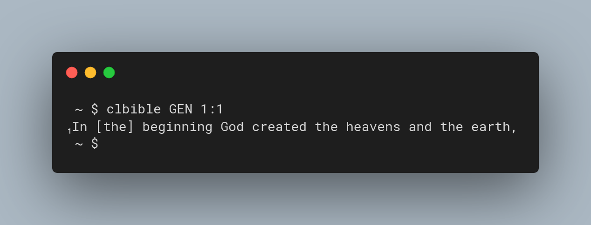
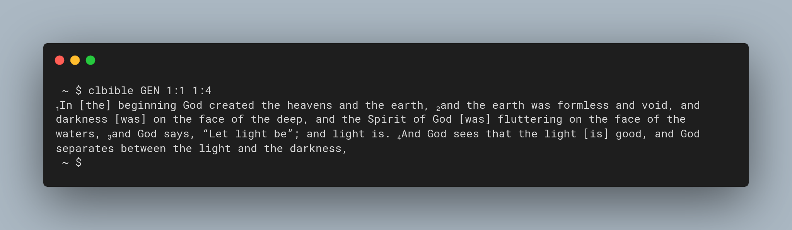
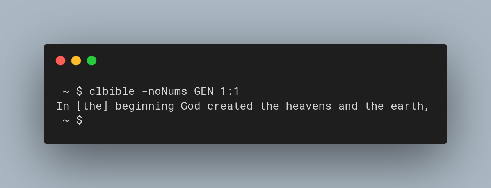
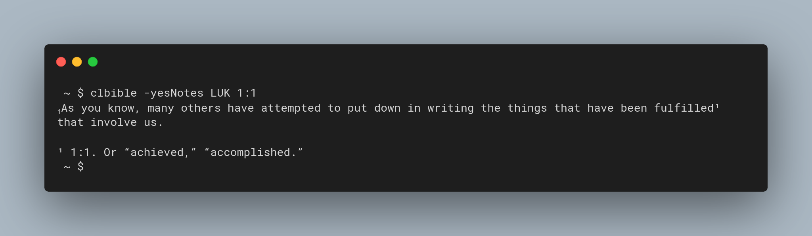
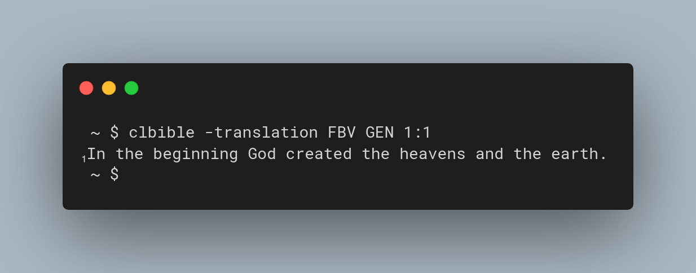

# clbible

`clbible` (as in "command line bible") is a tool to query bible verses in the terminal.

## Usage

### Single Verse

If you provide one chapter and one verse to clbible, it will print that verse.



### Multiple Verses

If you provide one chapter and a start and end verse to clbible, it will print all verses from the start to the end verse.



### Options

You can enable/disable verse numbers with `-yesNums` and `-noNums` options.



You can enable/disable notes with the `-yesNotes` and `-noNotes` options.



You can specify the translation you want to use with the `-translation` option



## Installation

You can install clbible either manually, or if you use an Arch Linux system with the PKGBUILD.

### Manual Installation

To manually install clbible, first compile it using the command `go build *.go`.
Then move the generated `clbible` binary to a location in your `$PATH`.

### PKGBUILD

On an Arch Linux based system you can install clbible with `makepkg -si`.

## Setup

After installation you need to write a config file and provide one or more translations.

### Config File

To configure clbible, a json config file is used.
It should be placed in `~/.clbible/config.json`.
Here you can specify the same options, as with the command line parameters.
You should at least set the default translation you use.

The possible options are:

- translationsDir: the folder, where the translations reside in
- translations: the default translation. More specifically, the folder name of that translation.
- showVerseNumbers: if verse numbers should be shown
- showNotes: if notes should be shown

The default config looks like this.
```json
{
  "translationsDir": "$HOME/.clbible/translations",
  "translation": "ELB",
  "showVerseNumbers": true,
  "showNotes": false
}
```

### Translations

You also need to provide at least one bible translation in usx format.
These can be downloaded for example here https://open.bible/bibles/ .
By default they should be placed in `~/.clbible/translations/`.
A translation is a single folder containing multiple .usx files.
The name of this folder is used to specify which translation is used by the `translationsDir` config option.
They should look like this:

```
~/.clbible/translations/LSV/
├── 1CH.usx
├── 1CO.usx
├── 1JN.usx
├── 1KI.usx
├── 1PE.usx
├── 1SA.usx
├── 1TH.usx
├── 1TI.usx
├── 2CH.usx
├── 2CO.usx
...
```
